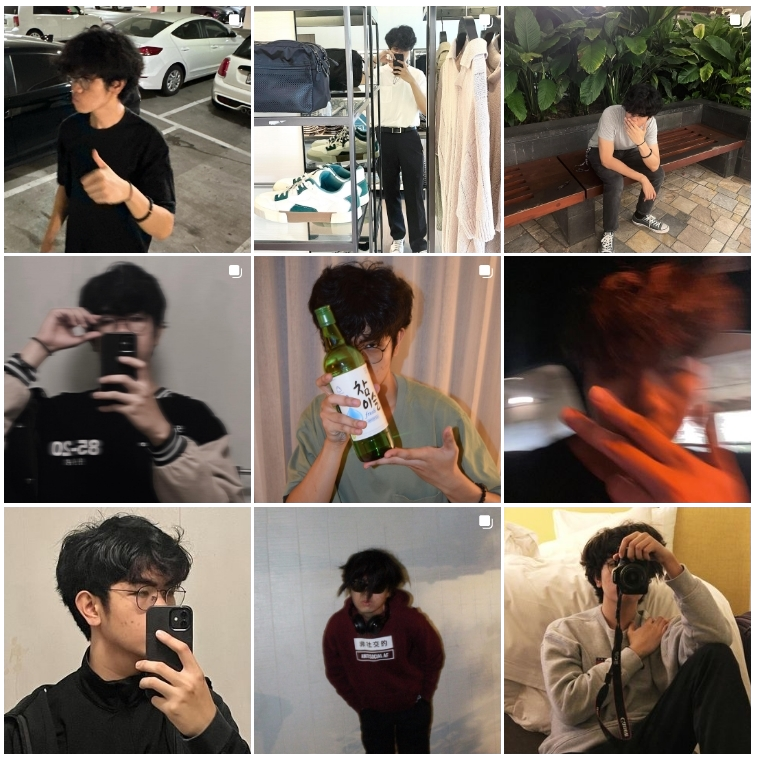
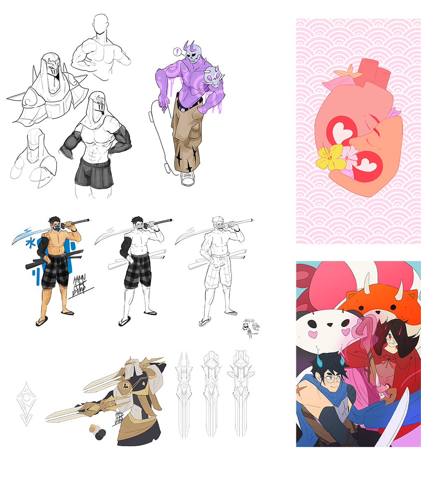

# About the Author

# Aaron Ramos

## Education
* Sophomore at the _University of Hawai'i at Mānoa_
* Expecting to graduate as of Spring 2025
* Looking to build a career as a **software engineer**
* Pursuing a bachelor's degree in computer engineering
  > "I want to be a computer engineer mostly because I spent a lot of time on the internet,
   to the point where I can say it's "raised" me. I also grew up playing lots of video games
   online, so it only feels natural that I'd find an interest in programming, and anything
   adjacent to computer engineering."

## Hobbies
 Although computer engineering is a deep interest of mine, I also enjoy:
 * Playing video games
   * _League of Legends_
   * _Minecraft_
   * _Lost Ark_
   * _Diablo 3_
 * Graphic design
 * Fashion
 * Photography
 * Videography
 * Digital Illustration
 * Social Media

## Photos
Some silly little pictures I've taken! (_via Instagram_)

## Illustrations
A few sketches and illustrations that I've worked on.

## Links
My GitHub account is located [here](https://github.com/aar0m).

My LinkedIn account is located [here](https://www.linkedin.com/in/aaron-ramos-61569424a/).

For other purposes, please reach out to my email: ramosab@hawaii.edu.
