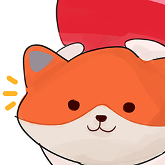
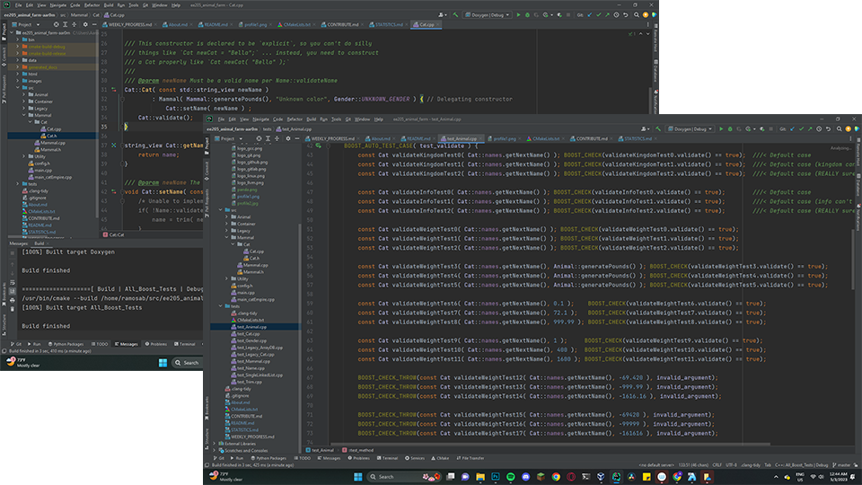

# EE205 Animal Farm
 

# Welcome to Aaron's Animal Farm

This Animal Farm project is the resulting product of tasking an undergraduate
named Aaron Ramos, who once knew nothing about object-oriented programming, 
let alone C or C++, with the goal of constructing a usable API from scratch. 
Currently, this API allows a user to instantiate a custom Animal.
_This Animal Farm was built under the tutelage of Professor Mark Nelson, 
renowned magician and passionate cat enthusiast, someone whom I have grown to 
admire and aspire to emulate as a software engineer, and Rachel Watanabe, the
most reliable graduate student known to man (probably) and someone who has 
graciously put up with my coding problems (thank you Rachel!)._

## Lessons Exercised by Building Animal Farm

* Understanding the difference between C and C++
* Declaring and implementing _classes_
  * Difference between .h and .cpp files
  * Inheritance of _classes_ (parent/child relation)
  * Various types of _members_ and _methods_ (static, abstract, etc.)
* Developing clean, constant, and *classy* documentation habits
* Writing _test driven_ code via **BOOST**
* Troubleshooting coding issues synchronous and asynchronously
* Internalizing feedback from code reviews
* Utilizing foreign API primarily through documentation
* Learning that Professor Mark may be ~~a bunch of cats in a human disguise~~ a really smart software engineer

## Timeline

| Assignment    | Description                                                                                                                             |
|---------------|-----------------------------------------------------------------------------------------------------------------------------------------|
| Animal Farm 0 | Instantiate the Farm in CLion & GitHub.  Ensure that Doxygen functions as intended. Create an ABOUT.md                                  |
| Animal Farm 1 | Learn about structures and get familiar with Clion by creating a simple Cat structure.                                                  |
| Animal Farm 2 | Create config.h and develop basic classes like Gender and Animal.                                                                       |
| Animal Farm 3 | Further develop Gender. Implement classes Node, Container, and SingleLinkedList. Learn how basic methods related to a SingleLinkedList. |
| Animal Farm 4 | Develop Mammal class and a selection sort method for SingleLinkedList.                                                                  |
| Animal Farm 5 | Learn how to use a provided Name class, how to port code, and refactoring code after breaking it.                                       |
| Animal Farm 6 | Publish project to the internet. Understand the difference between complete and "Done" with a capital 'D'.                              |

## Links
The project's home page (hosted by GitHub) is [here](https://github.com/EE-205/ee205_animal_farm-aar0m)

The source code documentation (hosted by UH) is [here](https://www2.hawaii.edu/~ramosab/ee205_animal_farm/)

## Toolchain
This project is the product of a tremendous amount of R&D and would not be possible without the following world-class tools:

| Tool           | Website                     |
|----------------|-----------------------------|
| **gcc**        | https://gcc.gnu.org         |
| **llvm/clang** | https://clang.llvm.org      |
| **CLion**      | https://jetbrains.com/clion |
| **CMake**      | https://cmake.org           |
| **Doxygen**    | https://doxygen.nl          |
| **DOT**        | https://graphviz.org        |
| **Boost**      | https://boost.org           |
| **Git**        | https://git-scm.com         |
| **GitHub**     | https://github.com          |
| **Linux**      | https://kernel.org          |
| **ArchLinux**  | https://archlinux.org       |
| **VirtualBox** | https://www.virtualbox.org  | 
